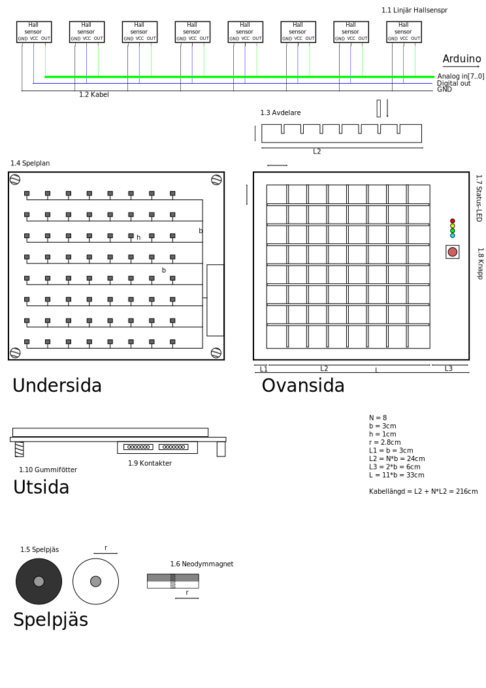
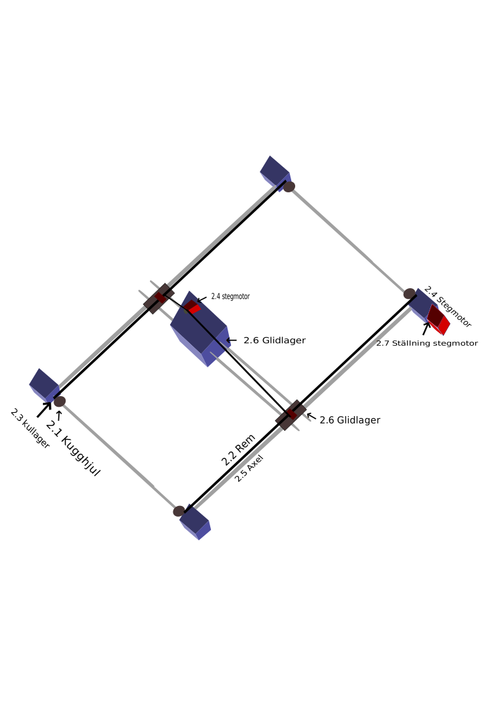

# Projektplan Elektromekaniskt projekt 2018
5 hp projektarbete som del av civilingenjörsutbildningen i Teknisk fysik, inriktning inbyggda system.
## Deltagare
* Jacob Olofsson
* Thomas Danielsson
* Aksel Wennström

## Design
I detta projekt ska vi konstruera en robot som kan spela othello mot en mänsklig motståndare. Vi har delat upp designen i tre stycken huvuddelar:
* Spelplan med sensor
* Mjukvara / AI
* Mekanisk förflyttning av pjäser
AI:t ska kunna få information om hur spelplanen ser ut, beräkna ett drag och sedan skicka information om hur draget ska utföras till en robotarm eller annan mekanism som utför draget på den fysiska spelplanen.

### Minsta fungerade produkt (MVP)
Den minsta fungerande produkten vi har är en robot som kan läsa av spelplanen och göra ett slumpmässigt "lagligt" drag.
* Roboten matas med pjäs av rätt färg från mänsklig spelare
* AI:t spelar alltid som samma färg
* AI:t har inget minne
* AI:t utför ett drag efter extern input
* Mäsnkliga motståndaren måste vända på pjäserna som påverkas av draget
* Statuslampor visar i vilket state programmet är
* Mekanismen ska gå att nollställas efter utfört eller misslyckat drag

### Funktioner att lägga till efter MVP
Eftert den minsta fungerande produkten har implementerats kommer följande funktioner läggas till:
1. Det går att välja färg på AI:t
1. Efter AI:t utfört ett drag vänder den alla pjäser som blir påverkade av draget
1. Mekanismen plockar upp nya pjäser utan mänsklig hjälp
1. AI:n gör "smarta" drag
1. Möjlighet att ställa in betänketid och/eller svårighetsgrad
1. Display som kan visa mer information om state
1. AI:t känner av när motståndaren utfört sitt drag och fortsätter automatiskt med sitt drag utan input
1. Möjlighet att ha två olika AI:n som spelar mot varandra
1. Bygga två stycken robotar som spelar mot varandra

### Designval
Följande val behöver göras för designen:

#### Spelplan med sensor
* Vilken storlek ska planen ha och hur många rutor ska det vara?
* Vilken sorts sensor ska användas för att känna av färg/position av pjäser?
  * Kamera - Beräkna ljusstyrkan i varje punkt där en pjäs kan befinna sig
  * Fotosensor under planen - Planen görs i genomskinligt material med en fotosensor under
  * Elektrisk / magnetisk krets - Konstruera pjäserna så att de sluter olika kretsar när de placeras på planen

Slutsats: Standard Othello spelas på 8x8. Varje ruta bör vara 3x3cm med en avskiljare som är max 1cm hög för att en mmänsklig spelare enkelt ska kunna lyfta upp och placera pjäser. Vi väljer att sätta linjära halleffektsensorer under planen och sätta magneter i spelpjäserna. Med en halleffektsensor går det att känna av riktning på magneten eller om en ruta är tom.
#### Förflyttning av pjäser
* Hur ska pjäserna plockas upp?
  * Elktromagnet
  * Gripklo
* Hur ska "upplockaren" röra sig?
  * I en bana  (som på en 3D-skrivare)
  * En arm med leder
* Hur ska pjäserna byta färg?
  * Vända på pjäserna?
  * Byta ut pjäserna?
* Vilken sorts motor ska användas?

Slutsats: Eftersom pjäserna har en magnet är det praktiskt att använda en elektromagnet för att plocka upp pjäserna. För att ha så få frihetsgrader i systemet som möjligt används en bana likt i en 3D-skrivare. För enkelhet i en första design kommer roboten varken att vända eller byta ut pjäser, detta lämnas till människospelaren. Stegmoterer bör användas för förflyttningen i sidled och en servomotor för upplockandet av pjäser.

#### Mjukvara
* Hur ska programmet struktureras?
  * Hur ska interfacen mellan de olika programdelarna se ut?
* Vilken AI-algorithm ska användas?
  * Monte Carlo
  * Min/max

Slutsats: TBD

#### Hårdvara
Valet av processor kommer att styras i stor del av hur mjukvaran, sensorn och hur förflyttningen och spelplanen designas.
* Vad för sorts processor ska användas?
  * IC
  * Arduino
  * Raspberry Pi
  * Dator
* Ska samma processor användas för AI, sensor och förflyttning eller ska separata processorer som kommunicerar med varandra användas?
* Strömkälla

Slutsats: För enkelhet bör samma processor användas till allt då det finns lite att tjäna i att ha separat hårdvara för de olika delarna. Minst 8 analoga ingångar och 12 digitala utgångar krävs för designen och en någorlunda snabb processor. Förslagsvis en arduino Mega. Separata strömkällor bör användas till motorer och arduino för att minska störningar.

## Skiss
### Spelplan
Spelplanen är uppdelad i 8x8 rutor med en avskiljare mellan varandra för att pjäserna inte ska kunna glida över till rutan brevid. Spelplanen är kopplad till en arduinos 8 digital out, 8 Analog in för multiplex av 64 sensorer. Spelplanen har även 1 digital in för knappen samt 4 digital out för LED kopplad till arduinon för I/O.

### Arm för att plocka upp pjäser

### Anordning för att flytta armen

## Delar
| Del | Benämning | Antal | Butik 1 | Butik 2 |
| --- | --------- | ----- | ------- | ------- |
| 0.1 | Arduino Mega | 1st | [Elfa](https://www.elfa.se/sv/mikrostyrenhetskort-mega2560-r3-a000067-atmega2560-arduino-a000067/p/11038920?channel=b2c&price_gs=437.5&wt_mc=se.cse.gshop.sv.-&source=googleps&ext_cid=shgooaqsesv-na&gclid=Cj0KCQiAiKrUBRD6ARIsADS2OLnJw6LyRBOy0xbVTKBopU4j0G5_wbOAGRTQvv3c3tdgh4Iv977cjsgaAhNxEALw_wcB) | [Conrad](https://www.conrad.se/?websale8=conrad-swe&pi=191790&ws_tp1=cp&ref=kelkoo&subref=191790&utm_source=kelkoo&utm_medium=cpc&utm_campaign=kelkoo_feed&utm_content=191790) |
| 1.1 | Linjär Halleffektsensor | 64st | [Electrokit](https://www.electrokit.com/allegro-a1301-sip3-halleffektsensor-2-5mv-g.52933) | [Elfa](https://www.elfa.se/en/low-noise-linear-sensor-sip-allegro-a1326lua/p/17333935?q=hall+analog&page=1&origPos=1&origPageSize=25&simi=95.19) | 
| 1.2 | Kopplingskabel | 16x220cm | [Electrokit](https://www.electrokit.com/kopplingstrad-0-05mm%25C2%25B2-50m-svart.54262)  | [Elfa](https://www.elfa.se/sv/kopplingstrad-50-mm-svart-tinned-copper-silikon-rnd-cable-rnd-475-00485/p/30090251?q=kopplingstr%C3%A5d&page=3&origPos=25&origPageSize=50&simi=99.98) |
| 1.3 | Avdelare, plastglas | 14x24cm | [Biltema](http://www.biltema.se/sv/Bygg/Ovrigt/Plastglas-2000030030/) | [Jula](https://www.jula.se/catalog/bygg-och-farg/beslag/inredningsbeslag/plastskivor/akrylplast-341071?gclid=Cj0KCQiAiKrUBRD6ARIsADS2OLknfkM98twJ0wUkssHdzIcDK2rWlab4vHQ5O6F3Wj3-UlX249CZlf4aAm6iEALw_wcB) |
| 1.4 | Plan, plastglas | 33x33cm | [Biltema](http://www.biltema.se/sv/Bygg/Ovrigt/Plastglas-2000030030/)| [Jula](https://www.jula.se/catalog/bygg-och-farg/beslag/inredningsbeslag/plastskivor/akrylplast-341071?gclid=Cj0KCQiAiKrUBRD6ARIsADS2OLknfkM98twJ0wUkssHdzIcDK2rWlab4vHQ5O6F3Wj3-UlX249CZlf4aAm6iEALw_wcB) |
| 1.5 | Spelpjäs, trä | 1x45x45cm | [Bauhaus](https://www.bauhaus.se/mdf-skiva-10mm-10x1220x2440mm.html) | [Byggmax](https://www.byggmax.se/skivmaterial/byggskivor/mdf/mdf-p10082) | 
| 1.6 | Neodymmagnet 5mmx5mm | 64st | [Electrokit](https://www.electrokit.com/magnet-neo35-o5mm-x-5mm.50573) | [Elfa](https://www.elfa.se/en/bar-magnet-neo-35-sura-magnets-na35-005/p/13752011?q=neo+35+bar&page=4&origPos=4&origPageSize=25&simi=98.26) |
| 1.7 | LED | 4st | [Elfa](https://www.elfa.se/sv/lysdiod-mm-t1-groen-kingbright-7104gd/p/17510161?q=led&sort=Price:asc&page=16&origPos=281&origPageSize=50&simi=99.71) | [Electrokit](https://www.electrokit.com/led-gron-3mm-lagstrom-2ma-tllg4401.44653) |
| 1.8 | Vippa | 1st | [Elfa](https://www.elfa.se/sv/vippstroemstaellare-on-off-1p-starcote-k3/p/13500600?q=*&sort=Price:asc&filter_Buyable=1&filter_Category3=Vippstr%C3%B6mst%C3%A4llare&page=1&origPos=44&origPageSize=50&simi=99.65) | [Electrokit](https://www.electrokit.com/vippomkopplare-1pol-lodoron-onon-mts102.42011?sort=price_asc) |
| 1.9 | Flatkabel | minst 22 poler | [Electrokit](https://www.electrokit.com/flatkabel-gra-26-ledare-1-27mm-m.44069) | [Elfa](https://www.elfa.se/sv/flatkabel-27-mm-25x0-08-mm-3m-3365-25/p/15566357?q=flatkabel&page=28&origPos=135&origPageSize=50&simi=99.65) |
| 1.9 | Kontakter | minst 22 poler | [Elfa](https://www.elfa.se/sv/stiftlist-hona-50-fischer-elektronik-mk01-50z/p/14384049?q=stiftlist&page=13&origPos=248&origPageSize=50&simi=99.63)  | [Electrokit](https://www.electrokit.com/stiftlist-2-54mm-1x40p-brytbar.43412) |
| 1.10 | Gummifötter | 4st | [Electrokit](https://www.electrokit.com/gummifot-o11x5mm-gra.43380?sort=price_asc) | [Elfa](https://www.elfa.se/sv/gummifoetteroo-25-mm-11-mm-svart-reinshagen-1841/p/14886891?channel=b2c&price_gs=9.5125&wt_mc=se.cse.gshop.sv.-&source=googleps&ext_cid=shgooaqsesv-na&gclid=Cj0KCQiAiKrUBRD6ARIsADS2OLlYWaRFKkrCeVBkSxIdsWjV9c2qDOGwhMzEP0Zd5aZWickX0hMJZ_4aAlyCEALw_wcB) |
| 2.1 | Kuggremsskiva 6mm | 4st | [Electrokit](https://www.electrokit.com/kuggremskiva-xl-10t-6mm.51634) |  |
| 2.2 | Kuggrem | 3m | [Electrokit](https://www.electrokit.com/kuggrem-xl-3-8-m.51829) | |
| 2.3 | Kullager(lagerbock) | 4st | [Electrokit](https://www.electrokit.com/lagerbock-o6mm-plast.51303) | |
| 2.4 | Stegmotor | 2st | [Electrokit](url) | [Kjell&Company](https://www.kjell.com/se/sortiment/el-verktyg/arduino/tillbehor/luxorparts-stegmotor-nema-17-p90776) |
| 2.5 | Axel 6mm | 3st | [Electrokit](https://www.electrokit.com/axel-rostfritt-stal-6mm-x-300mm.53001) | |
| 2.6 | Glidlager(lagerbock)6mm | 8st | [Electrokit](https://www.electrokit.com/lagerbock-o6mm-plast.51303) |  |
| 2.7 | Ställning för stegmotor | 2st | [Kjell&Company](https://www.kjell.com/se/sortiment/el-verktyg/arduino/tillbehor/luxorparts-stegmotorhallare-nema-17-p90779) |  |
| 2.8 | Stegmotordrivare | 1st | [Electrokit](https://www.electrokit.com/dubbel-stegmotordrivare-for-arduino.53090) | [Kjell&Company](https://www.kjell.com/se/sortiment/el-verktyg/arduino/moduler/stegmotordrivare-1-2-a-p88218) |
| 2.9 | Batterieliminator | 1st | [Kjell&Company](https://www.kjell.com/se/sortiment/el-verktyg/stromforsorjning/nataggregat/ac-dc/stallbar-utspanning/stallbar-natadapter-3-12-v-(dc)-3-6-w-p44108) | [Electrokit](https://www.electrokit.com/batterieliminator-12v-2a.50115) |
| 2.10 | LCD | 1st | [Electrokit](https://www.electrokit.com/lcd-2x16-tecken-jhd162a-stn-bla-vit-led.44837) | [Kjell&Company](https://www.kjell.com/se/sortiment/el-verktyg/elektronik/optokomponenter/led-lcd-displayer/luxorparts-lcd-display-2x16-seriell-i2c-p90786) |
| 2.11 | Kuggremsskiva 5mm | 1st | [Electrokit](https://www.electrokit.com/kuggremskiva-xl-10t-5mm.55066) |  |
## Tidsplan
| Vad | Tidsåtgång | Påbörjas senast | Färdigställt senast | Beroende av |
| --- | ---------- | --------------- | ------------------- | ----------- |
| Specifikation av hårdvaru/mjukvaruinterface | 1 dag | ASAP | 27/4 | Oberoende |
| Programmera AI | 7 dagar | ASAP |  27/4 | Oberoende |
| Konstruktion av spelplan | 1 dag | ASAP | 27/4 | Oberoende |
| Bygga ställning | 4 dagar | ASAP |  20/4 | Specifikation spelplan |
| Konstruktion av spelpjäser | 1 dag | ASAP | 27/4 | Oberoende |
| Koppla in stegmotorer | 2 dagar | 20/4 |  27/4 | Byggd ställning |
| Koppla elektronik i spelplanen | 2 dagar | 28/4 | 30/4 | Specifikation av hw/sw interface, Konstruktion av spelplan|
| Programmera styrprogram för elektroniken i spelplanen | 3 dagar | 30/4 | 3/5 | Specifikation av hw/sw interface | 
| Programmera stegmotorrörelse | 3 dagar | 2/5 |  7/5 | Färdigställd spelplan |
| Felsöka elektronik i spelplanen | 4 dagar | 3/5 | 7/5 | Koppling av elektronik i spelplanen, styrprogram för spelplanen |
| Testa och felsöka AI | 4 dagar | 7/5 | 11/5 | Programmera AI, felsöka elektronik i spelplanen |
| Skriv rapport | 4 dagar | 11/5 | 15/5 | Allt ovan |  
